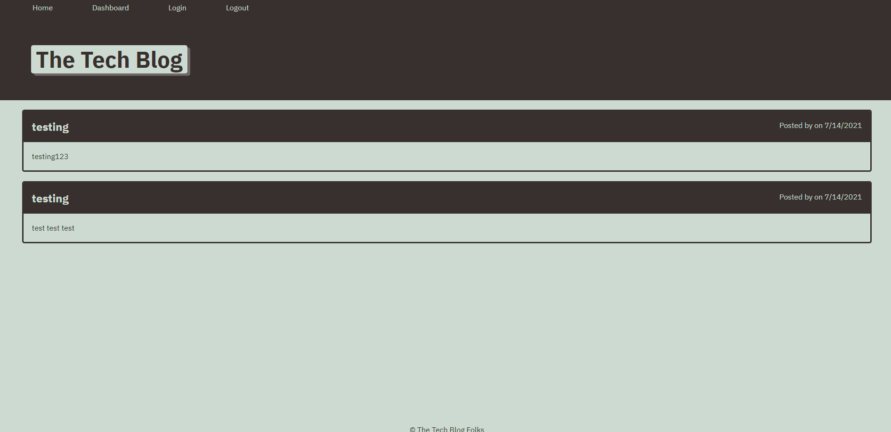

# techBlog

## Table of Contents
- [Overview](#overview)
- [Installation and Start](#installation-and-start)
- [Technology Used](#technology-used)
- [Screenshot and Deployed Link](#screenshot-and-deployed-link)
- [Questions](#questions)

## Overview

In the tech work it is important to writing about tech can be as well as making it. Developers around the world work together to solve problems to bugs as well as working together on a project. This app shows this concept as a tech blog.

### Installation and Start

npm i, node server.js

### Technology Used

- HTML
- CSS
- Javascript
- Sequelize
- Express
- Handlebars

### Screenshot and Deployed Link

[Techblog-on-Heroku](https://techblogsk.herokuapp.com/)

### Questions
If you have any questions, please refer to my Github page, [SaquebKhan](https://github.com/SaquebKhan), or contact me through my email, khansaqueb@gmail.com